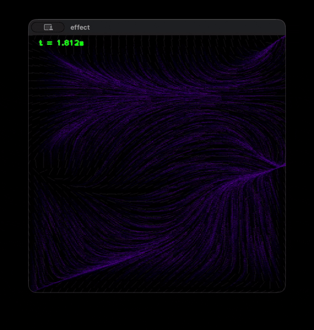

# ImageEffects

A C++ playground for real-time procedural image effects built on top of OpenCV.

The project currently features a **Perlin flow field** simulation: particles are spawned across a canvas and steered each frame by a vector field derived from Perlin noise. The result is a smoothly animated, organic-looking flow that can run in a live display window.

## Demos

<table><tr>
<td></td>
<td></td>
</tr></table>

## Key components

| File | Purpose |
|------|---------|
| `ImageEffect.h` | Abstract base class; every effect implements `operator()(float t)` |
| `PerlinNoise` | 2-D Perlin noise generator with optional octave stacking |
| `PerlinFlowEffect` | Particle system driven by a Perlin noise vector field |
| `PerlinNoiseEffect` | Renders the raw noise field as a grayscale/color image |
| `DisplayRenderer` | OpenCV-backed render loop that feeds frames to a window |
| `Random` | Lightweight random utility used for particle initialisation |

## Building

The project is set up as an Xcode project. Open `ImageEffects.xcodeproj`, select the *ImageEffects* scheme, and build. OpenCV must be available (e.g. via Homebrew: `brew install opencv`).

## Tests

Unit tests for the Perlin noise implementation live in `ImageEffectsTests/PerlinNoiseTests.mm` and can be run via the *ImageEffectsTests* scheme in Xcode.
